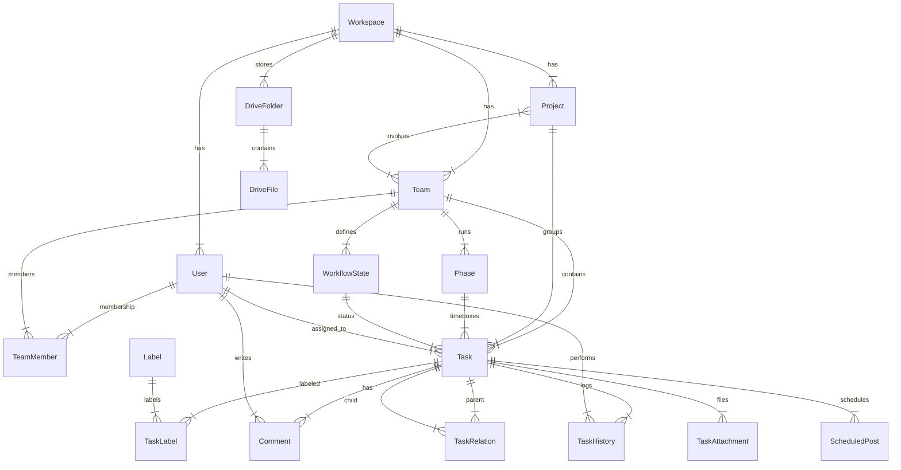

# Mô hình dữ liệu (Refined for Linear-like Architecture)

Schema thiết kế cho PostgreSQL/Supabase, tối ưu cho hiệu suất (Read-heavy) và trải nghiệm UX mượt mà (Linear-style).

## 1. Core Organization & Users

### Workspace (Organization)

Tương đương bảng `organizations` của Linear.

- `id` UUID (PK)
- `name` VARCHAR
- `slug` VARCHAR (Unique, dùng cho subdomain/url)
- `created_at` TIMESTAMP

### User (Global Profile)

Thay thế bảng `member` cũ. Lưu thông tin user ở cấp độ Workspace.

- `id` UUID (PK)
- `workspace_id` UUID (FK)
- `email` VARCHAR
- `display_name` VARCHAR
- `avatar_url` VARCHAR
- `role` VARCHAR (Global role: 'admin', 'member', 'guest' - giống Linear)
- `status` VARCHAR ('active', 'invited', 'disabled')
- `created_at` TIMESTAMP

### TeamMember (Junction)

_Giữ lại bảng này để đảm bảo yêu cầu "1 người thuộc nhiều team với role khác nhau"._

- `id` UUID (PK)
- `user_id` UUID (FK)
- `team_id` UUID (FK)
- `role` VARCHAR ('owner', 'admin', 'member', 'guest') - Role trong phạm vi Team.
- `preferences` JSONB (Lưu setting riêng của user cho team này)

## 2. Structure & Workflow

### Team

- `id` UUID (PK)
- `workspace_id` UUID (FK)
- `name` VARCHAR
- `key` VARCHAR (Prefix cho issue, VD: "ENG", "MKT")
- `description` TEXT
- `icon` VARCHAR
- `color` VARCHAR

### WorkflowState (Trạng thái)

Thay thế bảng `workflow` cũ. Mỗi Team tự định nghĩa các cột trạng thái riêng.

- `id` UUID (PK)
- `team_id` UUID (FK)
- `name` VARCHAR (VD: "In Progress", "Code Review")
- `color` VARCHAR
- `type` VARCHAR ('backlog', 'unstarted', 'started', 'completed', 'canceled') - Nhóm trạng thái chuẩn của Linear.
- `position` FLOAT (Dùng để sắp xếp thứ tự cột)

## 3. Work Items (The Core)

### Project

- `id` UUID (PK)
- `workspace_id` UUID (FK)
- `team_ids` UUID[] (Array - Project có thể thuộc nhiều Team)
- `strategic_id` UUID (FK)
- `name` VARCHAR
- `description` TEXT
- `state` VARCHAR ('planned', 'started', 'paused', 'completed', 'canceled')
- `health` VARCHAR ('on_track', 'at_risk', 'off_track')
- `lead_id` UUID (FK -> User)
- `start_date` DATE
- `target_date` DATE
- `milestones` JSONB

### Phase (Cycles)

- `id` UUID (PK)
- `team_id` UUID (FK)
- `name` VARCHAR (VD: "Cycle 24")
- `sequence_index` INTEGER
- `start_date` TIMESTAMP
- `end_date` TIMESTAMP
- `status` VARCHAR ('active', 'completed')

### Task (Issue)

- `id` UUID (PK)
- `workspace_id` UUID (FK)
- `team_id` UUID (FK)
- `number` INTEGER (Friendly ID, tự tăng theo Team. VD: 123 cho ENG-123)
- `title` VARCHAR
- `description` TEXT (Markdown)
- `priority` INTEGER (0: No, 1: Urgent, 2: High, 3: Medium, 4: Low)
- `state_id` UUID (FK -> WorkflowState)
- `assignee_id` UUID (FK -> User)
- `parent_id` UUID (FK -> Task)
- `project_id` UUID (FK)
- `phase_id` UUID (FK)
- `rank` VARCHAR (LexoRank - dùng để sắp xếp trong List/Board)
- `due_date` TIMESTAMP
- `created_by` UUID (FK -> User)
- `created_at` TIMESTAMP
- `updated_at` TIMESTAMP
- `deleted_at` TIMESTAMP (Soft delete)

### TaskRelation

- `id` UUID (PK)
- `task_id` UUID (FK)
- `related_task_id` UUID (FK)
- `type` VARCHAR ('subtask', 'duplicate', 'blocks', 'blocked_by', 'relates_to')

## 4. Meta & Interactions

### Label

- `id` UUID (PK)
- `team_id` UUID (FK - Nullable nếu là Global Label)
- `name` VARCHAR
- `color` VARCHAR

### TaskLabel (Junction)

Thay thế mảng `labels[]` để chuẩn hóa quan hệ nhiều-nhiều.

- `task_id` UUID (FK)
- `label_id` UUID (FK)

### TaskHistory (Audit Log)

Lưu vết thay đổi chi tiết (Change Data Capture).

- `id` UUID (PK)
- `task_id` UUID (FK)
- `actor_id` UUID (FK -> User)
- `field_changed` VARCHAR (VD: "status", "assignee", "priority")
- `from_value` TEXT
- `to_value` TEXT
- `created_at` TIMESTAMP

### Comment

- `id` UUID (PK)
- `task_id` UUID (FK)
- `user_id` UUID (FK)
- `body` TEXT
- `created_at` TIMESTAMP

## 5. Extended Features (Marketing OS Specific)

_Các bảng này giữ nguyên logic nghiệp vụ đặc thù của Marketing OS nhưng chuẩn hóa theo naming convention mới._

### AI & Content

- `ai_agent_profile`: Giữ nguyên.
- `marketing_content`: Giữ nguyên.
- `marketing_content_chunk`: Giữ nguyên.

### Drive & Assets

- `drive_folder`: Giữ nguyên.
- `drive_file`: Giữ nguyên.
- `task_attachment`: Link task với `drive_file` hoặc External URL.

### Social Scheduling

- `social_account`: Giữ nguyên.
- `scheduled_post`: Link với `task_id`.

## Ghi chú kỹ thuật

1. **Friendly ID**: Cần cài đặt Trigger DB để tự động tăng `number` khi insert Task mới vào Team.
2. **LexoRank**: Sử dụng thư viện hoặc thuật toán để sinh chuỗi `rank` khi kéo thả, tránh phải update lại toàn bộ danh sách.
3. **Performance**: Đánh Index kỹ lưỡng cho các cột FK (`team_id`, `assignee_id`, `state_id`, `project_id`).

## Sơ đồ quan hệ (ER Diagram)

hh
