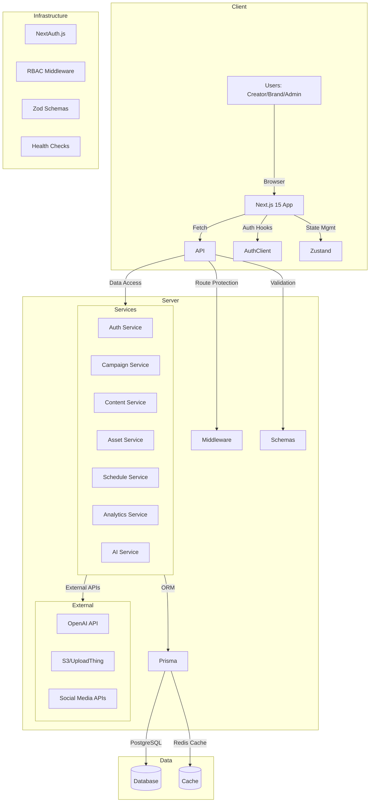

# ADR-001: AiM Platform Architecture

## Status

Accepted

## Context

AiM Platform cần một kiến trúc rõ ràng để hỗ trợ:

- Multi-tenant organization-based access
- Role-based access control (RBAC)
- AI-powered content generation
- Campaign management và content scheduling
- Real-time analytics và event tracking
- Scalable file storage và asset management

## Decision

Chúng ta sẽ sử dụng **Next.js 15 App Router** với **API Routes** pattern, **Prisma ORM** cho database layer, và **modular architecture** với clear boundaries giữa các layers.

### Architecture Overview



### Module Boundaries

#### 1. Presentation Layer (UI)

- **Components**: Reusable UI components theo shadcn/ui pattern
- **Pages**: Route-based pages với role-specific layouts
- **Hooks**: Custom React hooks cho business logic
- **State**: Zustand stores cho client-side state

#### 2. API Layer (Routes)

- **Route Handlers**: Next.js API routes với consistent patterns
- **Middleware**: Authentication, RBAC, validation
- **Response Format**: Standardized API responses với error handling

#### 3. Service Layer (Business Logic)

- **Domain Services**: Campaign, Content, Asset, Schedule, Analytics
- **Cross-cutting Services**: Auth, RBAC, AI integration
- **Validation**: Input validation với Zod schemas
- **Error Handling**: Consistent error handling patterns

#### 4. Data Layer (Persistence)

- **Prisma Client**: Type-safe database access
- **Migrations**: Database schema management
- **Seeding**: Test data và initial setup
- **Caching**: Redis cho frequently accessed data

#### 5. Infrastructure Layer

- **Authentication**: NextAuth.js với custom providers
- **Authorization**: RBAC middleware với permission system
- **Monitoring**: Health checks, logging, error tracking
- **Configuration**: Environment-based configuration

### Key Design Principles

1. **Separation of Concerns**: Clear boundaries giữa UI, API, services, và data
2. **Type Safety**: Full TypeScript coverage với Prisma-generated types
3. **Security First**: RBAC at every layer, input validation, secure defaults
4. **Performance**: Lazy loading, caching, pagination cho large datasets
5. **Scalability**: Modular design cho easy extension và maintenance

## Consequences

### Positive

- **Clear Architecture**: Developers có thể easily understand system structure
- **Type Safety**: Prisma + TypeScript provide excellent developer experience
- **Modularity**: Easy to add new features và modify existing ones
- **Security**: RBAC implemented at multiple layers
- **Performance**: Optimized data access và caching strategies

### Negative

- **Complexity**: Multi-layer architecture có thể complex cho simple features
- **Learning Curve**: Team cần understand Prisma, Next.js patterns
- **Overhead**: Additional abstraction layers có thể slow development initially

### Risks & Mitigations

- **Risk**: Over-engineering simple features
   - **Mitigation**: Start simple, add complexity only when needed
- **Risk**: Performance overhead từ multiple layers
   - **Mitigation**: Profile và optimize critical paths
- **Risk**: Database complexity với Prisma
   - **Mitigation**: Comprehensive testing và migration strategy

## Alternatives Considered

### 1. Monolithic API

- **Pros**: Simpler architecture, easier to understand
- **Cons**: Harder to scale, difficult to maintain, tight coupling

### 2. Microservices

- **Pros**: Independent scaling, technology diversity
- **Cons**: Overkill cho MVP, complex deployment, network overhead

### 3. Serverless Functions

- **Pros**: Auto-scaling, pay-per-use
- **Cons**: Cold starts, vendor lock-in, complex debugging

### 4. Traditional REST API

- **Pros**: Familiar pattern, extensive tooling
- **Cons**: Less type safety, manual validation, boilerplate code

## Implementation Notes

### Phase 1: Foundation

- Setup Next.js 15 với App Router
- Implement Prisma schema và migrations
- Setup NextAuth.js với RBAC
- Create basic service layer structure

### Phase 2: Core Features

- Implement Campaign, Content, Asset services
- Add scheduling system
- Setup analytics foundation
- Implement AI integration

### Phase 3: Enhancement

- Add advanced features (recurring schedules, AI quality metrics)
- Implement caching và performance optimization
- Add comprehensive monitoring và logging
- Setup CI/CD pipelines

### Technology Stack

- **Frontend**: Next.js 15, React 19, TypeScript 5
- **UI**: shadcn/ui, Tailwind CSS 4, Radix UI
- **Backend**: Next.js API Routes, Prisma 6
- **Database**: PostgreSQL
- **Authentication**: NextAuth.js 5
- **State Management**: Zustand, React Query
- **AI**: OpenAI API
- **Storage**: UploadThing/S3
- **Testing**: Jest, Playwright

### Code Organization

```
app/
├── (auth)/           # Authentication pages
├── (dashboard)/      # Role-based dashboards
├── api/             # API endpoints
│   └── [orgId]/     # Organization-scoped APIs
├── campaigns/        # Campaign pages
├── content/          # Content editor
├── calendar/         # Scheduling view
├── assets/           # Asset library
├── analytics/        # Analytics dashboards
└── settings/         # User/org settings

components/
├── ui/              # shadcn/ui components
├── forms/           # Form components
├── dashboards/      # Dashboard widgets
├── campaigns/       # Campaign components
├── content/         # Content editor
├── assets/          # Asset management
├── analytics/       # Charts & metrics
└── layout/          # Navigation & layout

lib/
├── prisma.ts        # Database client
├── auth.ts          # Auth utilities
├── rbac.ts          # Role-based access control
├── services/        # Business logic services
│   ├── campaigns.ts
│   ├── content.ts
│   ├── assets.ts
│   ├── schedules.ts
│   ├── analytics.ts
│   └── ai.ts
├── schemas.ts       # Zod validation schemas
└── utils.ts         # Common utilities
```

## References

- [Next.js 15 Documentation](https://nextjs.org/docs)
- [Prisma Documentation](https://www.prisma.io/docs)
- [NextAuth.js Documentation](https://next-auth.js.org/)
- [shadcn/ui Documentation](https://ui.shadcn.com/)
- [AiM Platform Specification](./../SPEC.md)
- [Data Model Documentation](./../data-model.md)

---

_Created: 2025-01-02_
_Last Updated: 2025-01-02_
_Author: AI-CTO Team_
_Reviewers: Engineering Team_
