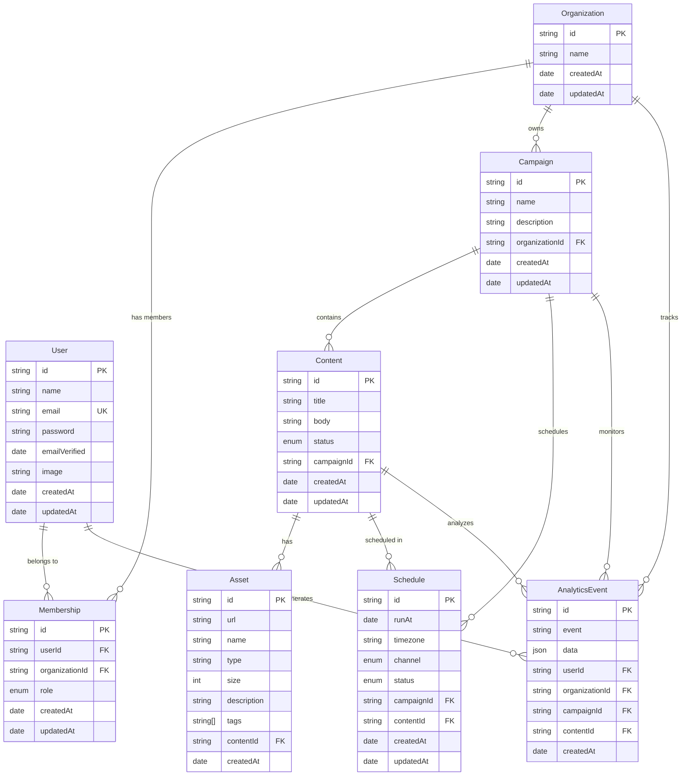

# AiM Platform - Data Model

## 📋 Table of Contents

- [Overview](#overview)
- [Core Entities](#core-entities)
- [NextAuth Integration](#nextauth-integration)
- [Entity Relationships](#entity-relationships)
- [Field Conventions](#field-conventions)
- [Database Schema](#database-schema)

## Overview

AiM Platform sử dụng **PostgreSQL** làm database chính và **Prisma ORM** để quản lý data access. Hệ thống được thiết kế với multi-tenancy architecture, mỗi organization có data riêng biệt.

### Tech Stack

- **Database**: PostgreSQL 15+
- **ORM**: Prisma 6
- **Authentication**: NextAuth.js 5
- **Validation**: Zod schemas

## Core Entities

### 👤 User

**Mô tả**: Người dùng hệ thống với authentication và role management

```typescript
interface User {
   id: string; // cuid
   name: string; // Display name
   email: string; // Unique email
   password?: string; // Hashed password (optional for OAuth)
   emailVerified?: Date; // Email verification timestamp
   image?: string; // Profile image URL
   createdAt: Date; // Account creation time
   updatedAt: Date; // Last update time
}
```

### 🏢 Organization

**Mô tả**: Tổ chức/company sử dụng platform

```typescript
interface Organization {
   id: string; // cuid
   name: string; // Organization name
   createdAt: Date; // Creation timestamp
   updatedAt: Date; // Last update time
}
```

### 🔗 Membership

**Mô tả**: Quan hệ giữa User và Organization với role assignment

```typescript
interface Membership {
  id: string;                    // cuid
  userId: string;                // Reference to User
  organizationId: string;        // Reference to Organization
  role: OrgRole;                 // User role in organization
  createdAt: Date;               // Membership creation time
  updatedAt: Date;               // Last update time
}

enum OrgRole {
  ADMIN           // Full system access
  BRAND_OWNER     // Campaign & content management
  CREATOR         // Content creation only
}
```

### 📢 Campaign

**Mô tả**: Chiến dịch marketing với content và scheduling

```typescript
interface Campaign {
   id: string; // cuid
   name: string; // Campaign name
   description?: string; // Campaign description
   organizationId: string; // Reference to Organization
   createdAt: Date; // Creation timestamp
   updatedAt: Date; // Last update time
}
```

### ✍️ Content

**Mô tả**: Nội dung marketing với approval workflow và scheduling

```typescript
interface Content {
  id: string;                    // cuid
  title: string;                 // Content title
  body?: string;                 // Content body (rich text)
  status: ContentStatus;         // Current content status
  campaignId: string;            // Reference to Campaign
  createdAt: Date;               // Creation timestamp
  updatedAt: Date;               // Last update time
}

enum ContentStatus {
  DRAFT          // Initial draft state
  SUBMITTED      // Submitted for review
  APPROVED       // Approved by brand owner
  SCHEDULED      // Scheduled for publication
  PUBLISHED      // Successfully published
  REJECTED       // Rejected during review
}
```

### 📁 Asset

**Mô tả**: File attachments (images, videos, documents) cho content

```typescript
interface Asset {
   id: string; // cuid
   url: string; // File storage URL
   name?: string; // Display name
   type: string; // MIME type
   size?: number; // File size in bytes
   description?: string; // Asset description
   tags: string[]; // Searchable tags
   contentId: string; // Reference to Content
   createdAt: Date; // Upload timestamp
}
```

### 🗓️ Schedule

**Mô tả**: Lịch trình xuất bản content với platform và timezone support

```typescript
interface Schedule {
  id: string;                    // cuid
  runAt: Date;                   // UTC timestamp for publication
  timezone: string;              // Timezone for display (e.g., "America/New_York")
  channel: Channel;              // Social media platform
  status: ScheduleStatus;        // Current schedule status
  campaignId: string;            // Reference to Campaign
  contentId?: string;            // Reference to Content (optional)
  createdAt: Date;               // Creation timestamp
  updatedAt: Date;               // Last update time
}

enum Channel {
  FACEBOOK       // Facebook posts
  INSTAGRAM      // Instagram posts
  TWITTER        // Twitter/X posts
  YOUTUBE        // YouTube videos
  LINKEDIN       // LinkedIn posts
  TIKTOK         // TikTok videos
  BLOG           // Blog articles
}

enum ScheduleStatus {
  PENDING        // Scheduled, waiting to publish
  PUBLISHED      // Successfully published
  FAILED         // Publication failed
  CANCELLED      // Schedule cancelled
}
```

### 📊 AnalyticsEvent

**Mô tả**: Event tracking cho analytics và performance monitoring

```typescript
interface AnalyticsEvent {
   id: string; // cuid
   event: string; // Event type
   data?: Json; // Event payload
   userId?: string; // Reference to User
   organizationId?: string; // Reference to Organization
   campaignId?: string; // Reference to Campaign
   contentId?: string; // Reference to Content
   createdAt: Date; // Event timestamp
}
```

## NextAuth Integration

### 🔐 Account

**Mô tả**: OAuth provider accounts cho NextAuth

```typescript
interface Account {
   id: string; // cuid
   userId: string; // Reference to User
   type: string; // OAuth provider type
   provider: string; // Provider name (google, github)
   providerAccountId: string; // Provider user ID
   refresh_token?: string; // OAuth refresh token
   access_token?: string; // OAuth access token
   expires_at?: number; // Token expiration
   token_type?: string; // Token type
   scope?: string; // OAuth scope
   id_token?: string; // ID token
   session_state?: string; // Session state
   oauth_token_secret?: string; // OAuth token secret
   oauth_token?: string; // OAuth token
}
```

### 🎫 Session

**Mô tả**: User sessions cho NextAuth

```typescript
interface Session {
   id: string; // cuid
   sessionToken: string; // Unique session token
   userId: string; // Reference to User
   expires: Date; // Session expiration
}
```

### ✅ VerificationToken

**Mô tả**: Email verification tokens

```typescript
interface VerificationToken {
   identifier: string; // Email address
   token: string; // Verification token
   expires: Date; // Token expiration
}
```

## Entity Relationships

### 🔗 Relationship Diagram



### 📍 Key Relationships

#### User ↔ Organization (Many-to-Many)

- **Through**: `Membership` table
- **Constraint**: Unique `(userId, organizationId)` combination
- **Role**: User có thể thuộc nhiều organization với role khác nhau

#### Campaign → Organization (Many-to-One)

- **Constraint**: Mỗi campaign thuộc về một organization
- **Cascade**: Khi organization bị xóa, campaigns cũng bị xóa

#### Content → Campaign (Many-to-One)

- **Constraint**: Mỗi content thuộc về một campaign
- **Workflow**: Content status flow: DRAFT → SUBMITTED → APPROVED → SCHEDULED → PUBLISHED

#### Schedule → Content (Many-to-One)

- **Constraint**: Mỗi schedule có thể liên kết với một content
- **Status Sync**: Khi tạo schedule, content status tự động → SCHEDULED
- **Timezone**: `runAt` lưu UTC, `timezone` chỉ để hiển thị

## Field Conventions

### 🆔 ID Fields

- **Primary Keys**: Sử dụng `cuid` cho tất cả entities
- **Foreign Keys**: Naming convention: `entityNameId` (e.g., `campaignId`, `contentId`)
- **References**: Luôn có `onDelete` behavior được định nghĩa

### 📅 Timestamp Fields

- **Created**: `createdAt` - tự động set khi tạo record
- **Updated**: `updatedAt` - tự động update khi modify record
- **Format**: ISO 8601 datetime strings

### 🔒 Status Fields

- **Content Status**: Enum với workflow progression
- **Schedule Status**: Enum với publication lifecycle
- **Org Role**: Enum với permission hierarchy

### 🌐 Timezone Handling

- **Storage**: `runAt` luôn lưu UTC timestamp
- **Display**: `timezone` field để hiển thị local time
- **Conversion**: Client-side conversion cho UI display

## Database Schema

### 🗄️ Prisma Schema

```prisma
// Core models với relationships
model User {
  id            String    @id @default(cuid())
  name          String?
  email         String    @unique
  password      String?
  emailVerified DateTime?
  image         String?
  createdAt     DateTime  @default(now())
  updatedAt     DateTime  @updatedAt

  // Relationships
  accounts      Account[]
  sessions      Session[]
  memberships   Membership[]
  analyticsEvents AnalyticsEvent[]
}

model Organization {
  id             String          @id @default(cuid())
  name           String
  createdAt      DateTime        @default(now())
  updatedAt      DateTime        @updatedAt

  // Relationships
  memberships    Membership[]
  campaigns      Campaign[]
  analyticsEvents AnalyticsEvent[]
}

model Membership {
  id             String     @id @default(cuid())
  userId         String
  organizationId String
  role           OrgRole
  createdAt      DateTime   @default(now())
  updatedAt      DateTime   @updatedAt

  // Relationships
  user           User       @relation(fields: [userId], references: [id], onDelete: Cascade)
  organization   Organization @relation(fields: [organizationId], references: [id], onDelete: Cascade)

  @@unique([userId, organizationId])
}

model Campaign {
  id             String          @id @default(cuid())
  name           String
  description    String?
  organizationId String
  createdAt      DateTime        @default(now())
  updatedAt      DateTime        @updatedAt

  // Relationships
  organization   Organization    @relation(fields: [organizationId], references: [id], onDelete: Cascade)
  contents       Content[]
  schedules      Schedule[]
  analyticsEvents AnalyticsEvent[]
}

model Content {
  id             String          @id @default(cuid())
  title          String
  body           String?
  status         ContentStatus   @default(DRAFT)
  campaignId     String
  createdAt      DateTime        @default(now())
  updatedAt      DateTime        @updatedAt

  // Relationships
  campaign       Campaign        @relation(fields: [campaignId], references: [id], onDelete: Cascade)
  assets         Asset[]
  schedules      Schedule[]
  analyticsEvents AnalyticsEvent[]
}

model Asset {
  id          String   @id @default(cuid())
  url         String
  name        String?
  type        String
  size        Int?
  description String?
  tags        String[]
  contentId   String
  createdAt   DateTime @default(now())

  // Relationships
  content     Content  @relation(fields: [contentId], references: [id], onDelete: Cascade)
}

model Schedule {
  id         String   @id @default(cuid())
  runAt      DateTime // UTC timestamp
  timezone   String   // Display timezone
  channel    Channel  // Social platform
  status     ScheduleStatus @default(PENDING)
  campaignId String
  contentId  String?
  createdAt  DateTime @default(now())
  updatedAt  DateTime @updatedAt

  // Relationships
  campaign   Campaign @relation(fields: [campaignId], references: [id], onDelete: Cascade)
  content    Content? @relation(fields: [contentId], references: [id], onDelete: SetNull)
}

model AnalyticsEvent {
  id             String      @id @default(cuid())
  event          String
  data           Json?
  userId         String?
  organizationId String?
  campaignId     String?
  contentId      String?
  createdAt      DateTime    @default(now())

  // Relationships
  user           User?       @relation(fields: [userId], references: [id])
  organization   Organization? @relation(fields: [organizationId], references: [id])
  campaign       Campaign?   @relation(fields: [campaignId], references: [id])
  content        Content?    @relation(fields: [contentId], references: [id])
}

// Enums
enum OrgRole {
  ADMIN
  BRAND_OWNER
  CREATOR
}

enum ContentStatus {
  DRAFT
  SUBMITTED
  APPROVED
  SCHEDULED
  PUBLISHED
  REJECTED
}

enum ScheduleStatus {
  PENDING
  PUBLISHED
  FAILED
  CANCELLED
}

enum Channel {
  FACEBOOK
  INSTAGRAM
  TWITTER
  YOUTUBE
  LINKEDIN
  TIKTOK
  BLOG
}
```

### 🔍 Indexes & Performance

```sql
-- Primary indexes (automatic)
CREATE INDEX ON "User"("email");
CREATE INDEX ON "Membership"("userId", "organizationId");
CREATE INDEX ON "Campaign"("organizationId");
CREATE INDEX ON "Content"("campaignId", "status");
CREATE INDEX ON "Schedule"("runAt", "channel");
CREATE INDEX ON "AnalyticsEvent"("createdAt", "event");

-- Composite indexes for common queries
CREATE INDEX ON "Schedule"("campaignId", "runAt");
CREATE INDEX ON "Content"("status", "createdAt");
CREATE INDEX ON "AnalyticsEvent"("organizationId", "createdAt");
```

---

_Last Updated: 2025-01-02_
_Version: 2.0_
_Maintainer: Engineering Team_
