# Marketing OS - Application Flow Diagrams

Tài liệu mô tả tất cả các luồng (flows) của ứng dụng Marketing OS (AiM) dưới dạng Mermaid diagrams, được tổ chức theo module.

---

# Module 1: Authentication & Authorization

## 1.1 Login Flow

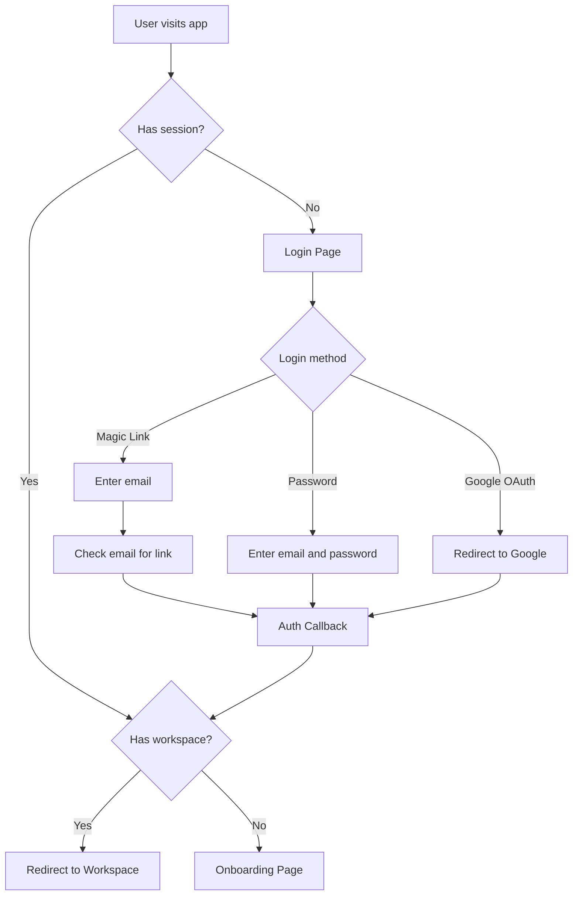

## 1.2 Registration Flow

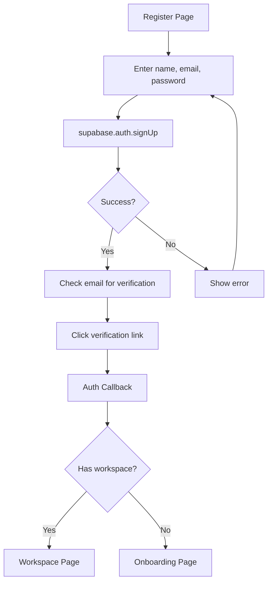

## 1.3 Password Recovery Flow

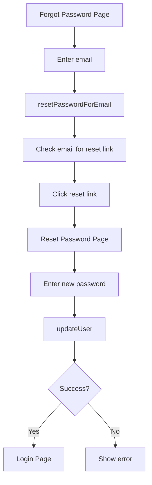

## 1.4 Logout Flow

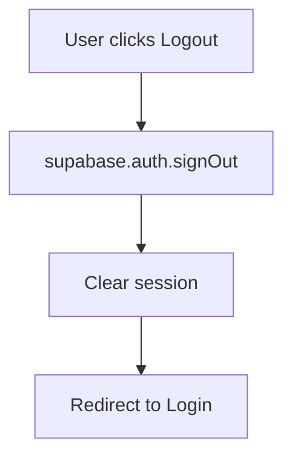

## 1.5 RBAC Permission Flow

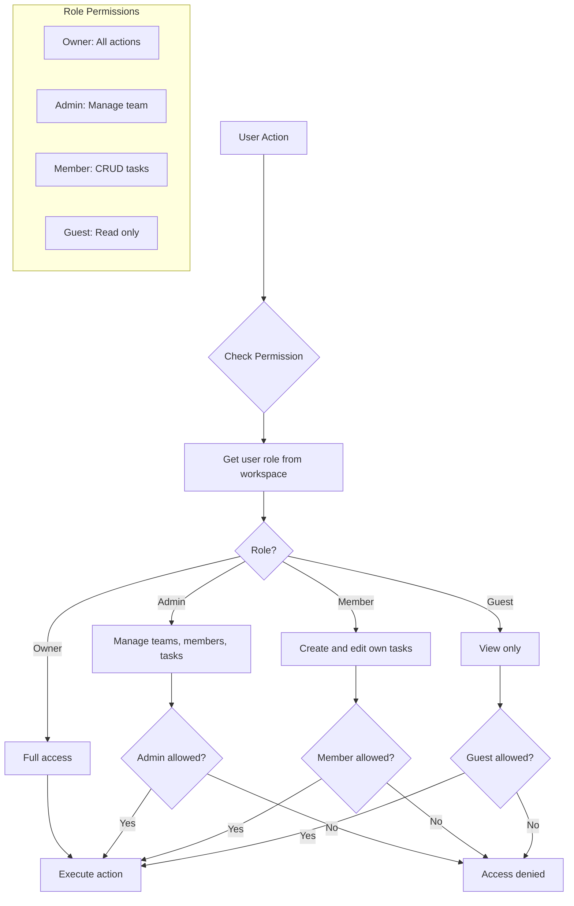

---

# Module 2: Onboarding & Workspace

## 2.1 Onboarding Flow

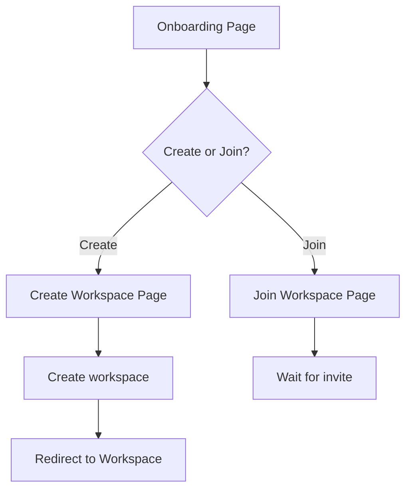

## 2.2 Workspace Creation Flow

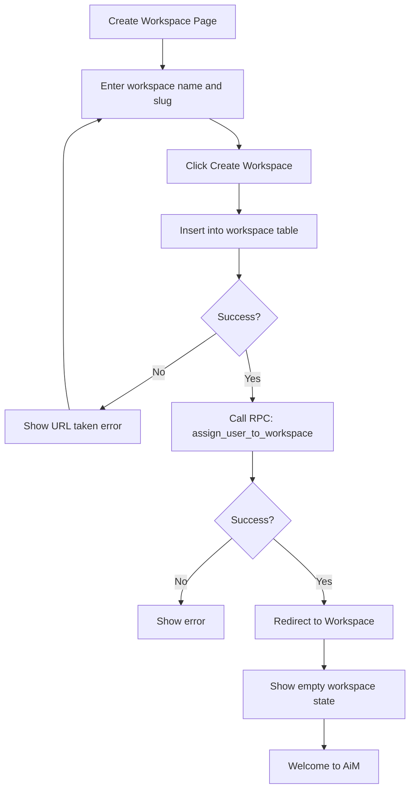

## 2.3 Invite Flow

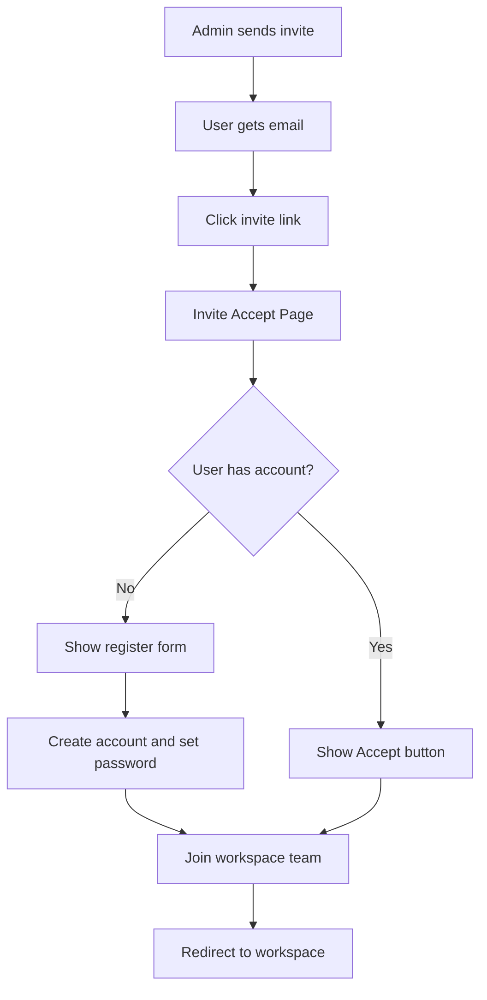

---

# Module 3: App Shell & Navigation

## 3.1 Main App Navigation (Linear-style Layout)

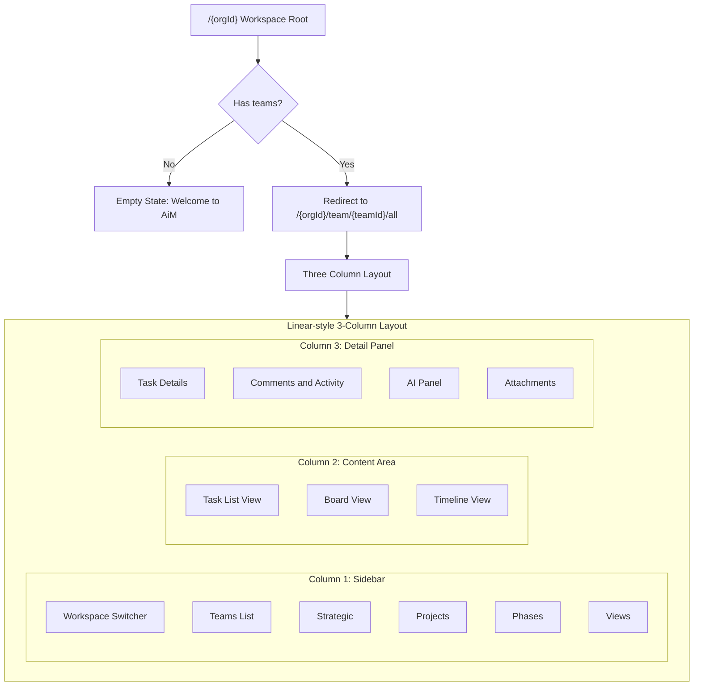

## 3.2 Workspace Routes Structure

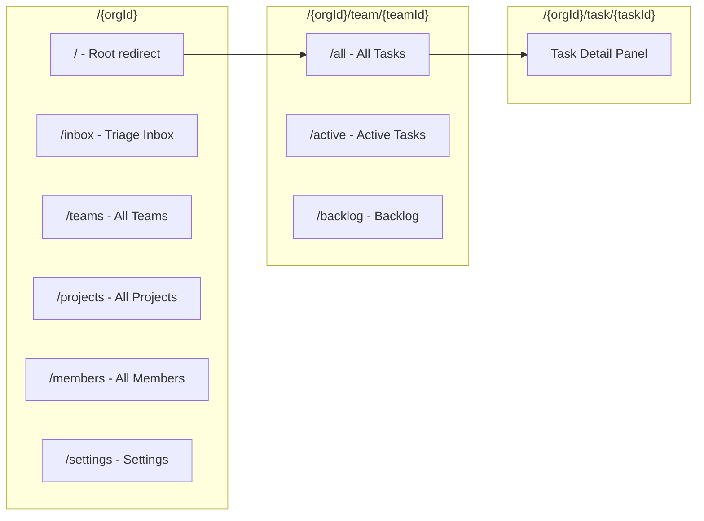

## 3.3 UI Component Hierarchy

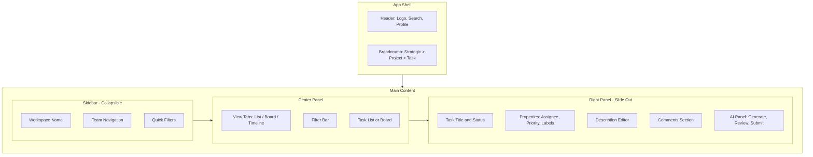

---

# Module 4: Team & Member Management

## 4.1 Team Management Flow

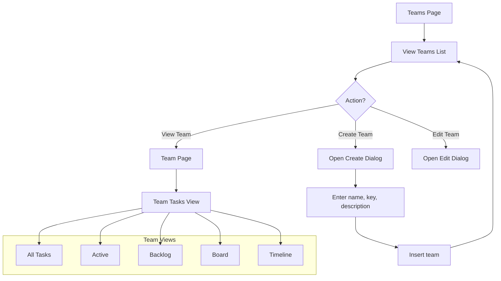

---

# Module 5: Task Management

## 5.1 Task CRUD Flow

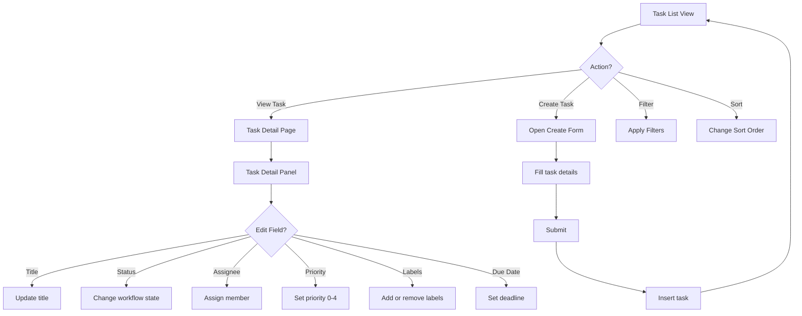

---

# Module 6: System Architecture

## 6.1 Application State Machine

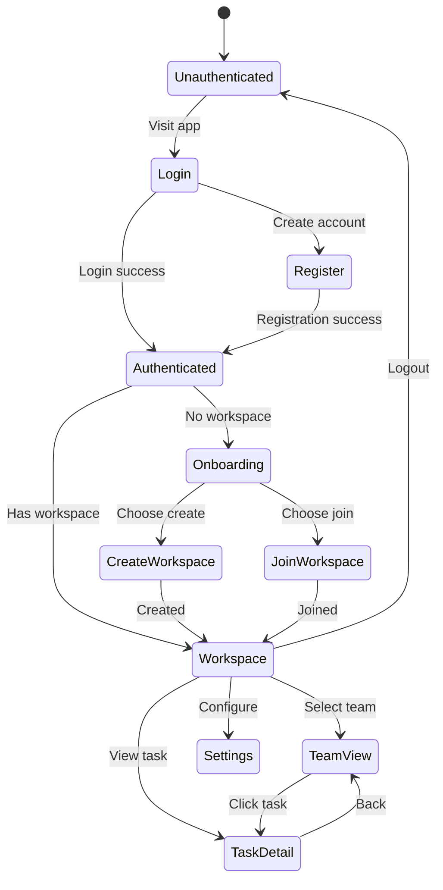

## 6.2 Data Flow - Supabase Architecture

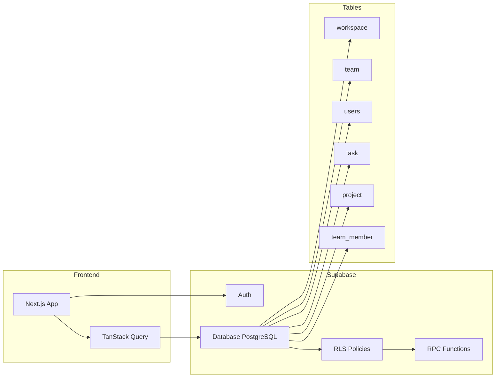

---

# Route Map

| Module | Route | Description |
|--------|-------|-------------|
| **Auth** | `/login` | Login page |
| **Auth** | `/register` | Registration page |
| **Auth** | `/forgot-password` | Password recovery |
| **Auth** | `/auth/callback` | OAuth callback |
| **Auth** | `/auth/reset-password` | Reset password form |
| **Onboarding** | `/onboarding` | Choose create or join |
| **Onboarding** | `/onboarding/create` | Create workspace |
| **Onboarding** | `/onboarding/join` | Join workspace |
| **Onboarding** | `/invite/accept` | Accept invitation |
| **Workspace** | `/{workspaceId}` | Workspace root |
| **Team** | `/{workspaceId}/teams` | All teams |
| **Team** | `/{workspaceId}/team/{teamId}` | Team view |
| **Task** | `/{workspaceId}/task/{taskId}` | Task detail |
| **Other** | `/{workspaceId}/projects` | All projects |
| **Other** | `/{workspaceId}/members` | All members |
| **Other** | `/{workspaceId}/inbox` | Triage inbox |
| **Other** | `/{workspaceId}/settings` | Settings |
