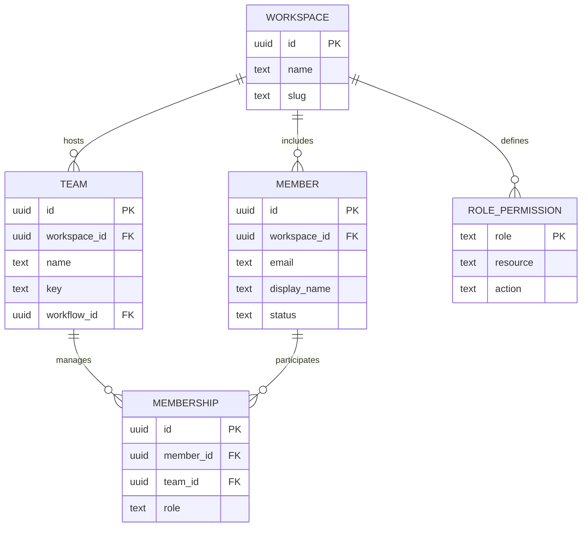
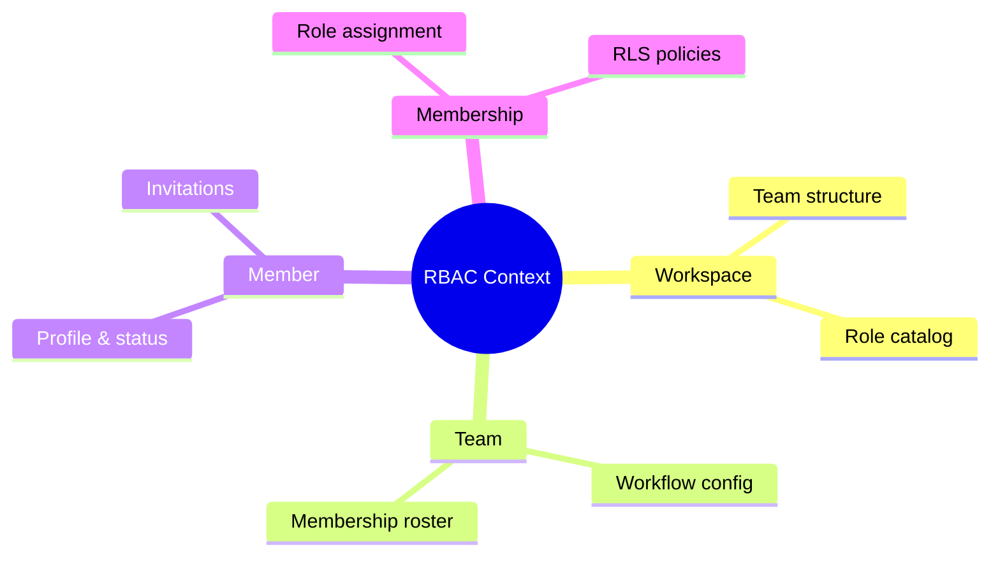

# Workspace-Team-Membership ERD

Relationship snapshot linking Workspace, Team, Member, Membership, and RolePermission for the initial RBAC schema described in `docs/DATA-MODEL.md` and `docs/modules/teams-and-members.md`.

