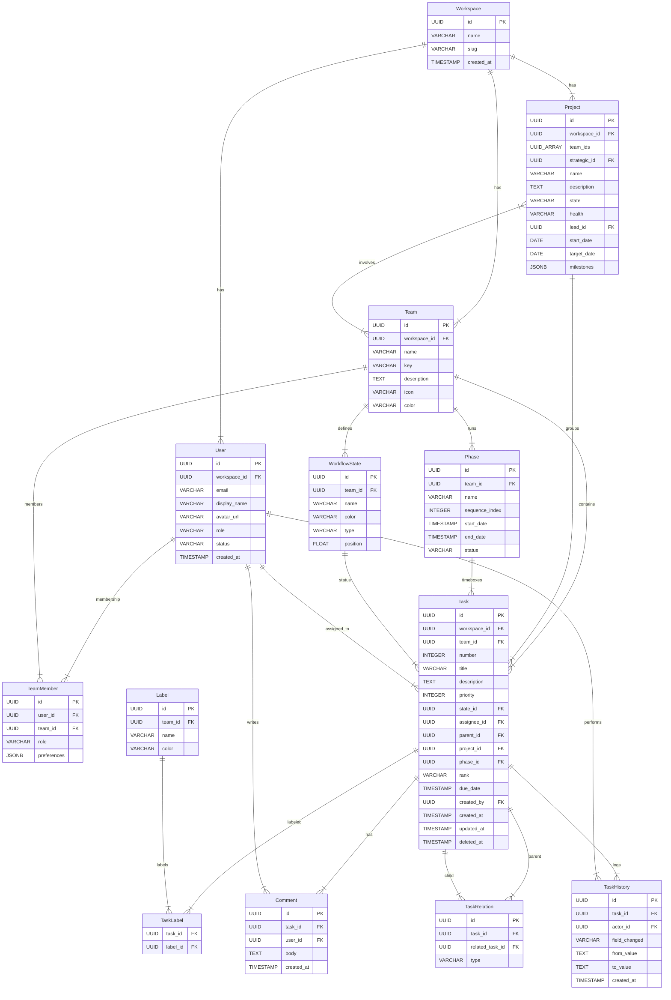

# Marketing OS - Entity Relationship Diagram

```mermaid
erDiagram
    Workspace {
        UUID id PK
        VARCHAR name
        VARCHAR slug
        TIMESTAMP created_at
    }
    User {
        UUID id PK
        UUID workspace_id FK
        VARCHAR email
        VARCHAR display_name
        VARCHAR avatar_url
        VARCHAR role
        VARCHAR status
        TIMESTAMP created_at
    }
    TeamMember {
        UUID id PK
        UUID user_id FK
        UUID team_id FK
        VARCHAR role
        JSONB preferences
    }
    Team {
        UUID id PK
        UUID workspace_id FK
        VARCHAR name
        VARCHAR key
        TEXT description
        VARCHAR icon
        VARCHAR color
    }
    WorkflowState {
        UUID id PK
        UUID team_id FK
        VARCHAR name
        VARCHAR color
        VARCHAR type
        FLOAT position
    }
    Project {
        UUID id PK
        UUID workspace_id FK
        UUID_ARRAY team_ids
        UUID strategic_id FK
        VARCHAR name
        TEXT description
        VARCHAR state
        VARCHAR health
        UUID lead_id FK
        DATE start_date
        DATE target_date
        JSONB milestones
    }
    Phase {
        UUID id PK
        UUID team_id FK
        VARCHAR name
        INTEGER sequence_index
        TIMESTAMP start_date
        TIMESTAMP end_date
        VARCHAR status
    }
    Task {
        UUID id PK
        UUID workspace_id FK
        UUID team_id FK
        INTEGER number
        VARCHAR title
        TEXT description
        INTEGER priority
        UUID state_id FK
        UUID assignee_id FK
        UUID parent_id FK
        UUID project_id FK
        UUID phase_id FK
        VARCHAR rank
        TIMESTAMP due_date
        UUID created_by FK
        TIMESTAMP created_at
        TIMESTAMP updated_at
        TIMESTAMP deleted_at
    }
    TaskRelation {
        UUID id PK
        UUID task_id FK
        UUID related_task_id FK
        VARCHAR type
    }
    Label {
        UUID id PK
        UUID team_id FK
        VARCHAR name
        VARCHAR color
    }
    TaskLabel {
        UUID task_id FK
        UUID label_id FK
    }
    TaskHistory {
        UUID id PK
        UUID task_id FK
        UUID actor_id FK
        VARCHAR field_changed
        TEXT from_value
        TEXT to_value
        TIMESTAMP created_at
    }
    Comment {
        UUID id PK
        UUID task_id FK
        UUID user_id FK
        TEXT body
        TIMESTAMP created_at
    }

    %% Relationships
    Workspace ||--|{ User : has
    Workspace ||--|{ Team : has
    Workspace ||--|{ Project : has

    User ||--|{ TeamMember : membership
    Team ||--|{ TeamMember : members

    Team ||--|{ WorkflowState : defines
    Team ||--|{ Phase : runs
    Team ||--|{ Task : contains

    Project }|--|{ Team : involves
    Project ||--|{ Task : groups

    Phase ||--|{ Task : timeboxes

    WorkflowState ||--|{ Task : status

    Task ||--|{ TaskRelation : parent
    Task ||--|{ TaskRelation : child
    Task ||--|{ TaskLabel : labeled
    Label ||--|{ TaskLabel : labels

    Task ||--|{ Comment : has
    Task ||--|{ TaskHistory : logs

    User ||--|{ Task : assigned_to
    User ||--|{ Comment : writes
    User ||--|{ TaskHistory : performs
```
